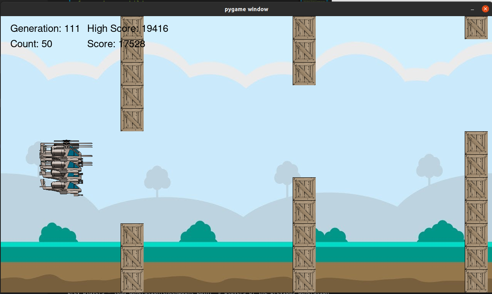
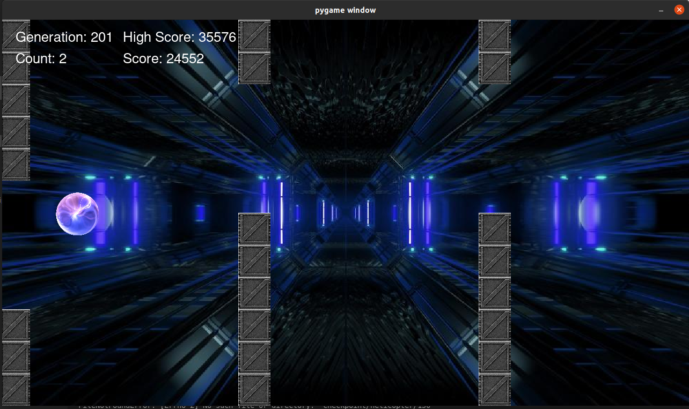
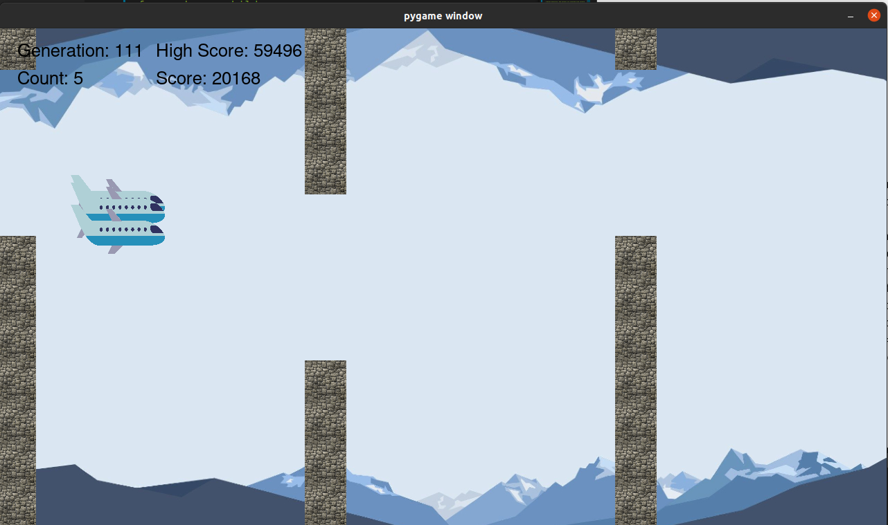
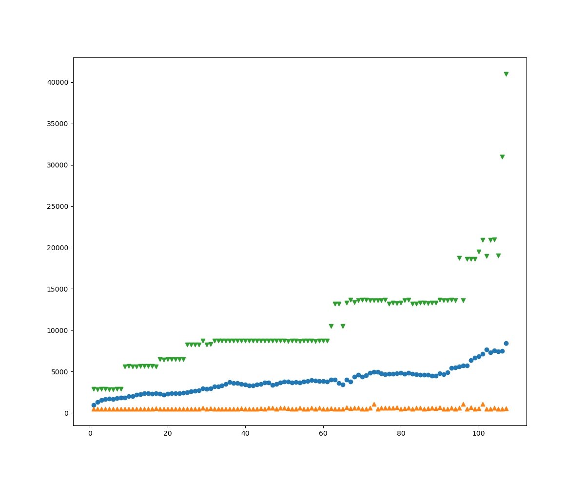

# EvolutionaryGames

This repository is a cloned version of [THIS](https://github.com/HosseinZaredar/EvolutionaryGames) repo.

It tries to solve a game with neural nets but since there isn't enough labeled data we use evolution strategy instead.

## Evolution Strategy

- Initial population: The first generation is created randomly with uniform distribution.

- Survivor Selection: The survivors of each generation are selected with Q-tournament with Q=5.

- Parent Selection: The parents are selected with uniform probability for crossover.

- Crossover: 4 types of crossover one is randomly selected for each new child:
    1- Local Intermediary: Child genes are average of two selected parents.

    2- Global Intermediary: Child genes are average of two selected parents for every gene.

    3- Local Discrete: Child genes are randomly selected from two parents.

    4- Global Discrete: Child genes are randomly selected from two parents for each gene.
    
- Mutation: Mutation happens for all members (pm = 1) but the sigma in Gaussian noise changes with 1/5 success rule for every 2 generation.

## Results

**Helicopter mode**

**Gravity mode**

**Thrust mode**

**Learning curve plot for helicopter mode**

